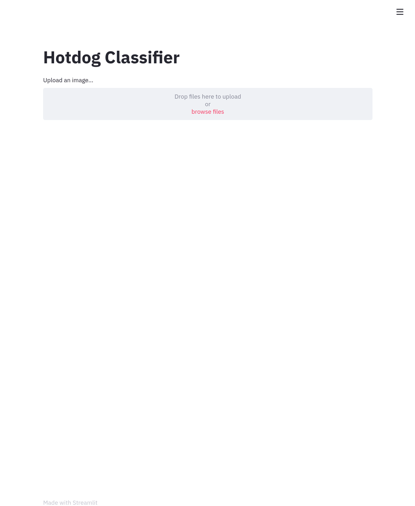

# A recreation of the famous [Not Hotdog](https://www.youtube.com/watch?v=ACmydtFDTGs) application from the HBO television series Silicon Valley. [](https://colab.research.google.com/drive/1DBzJNvDEdmOB2eg6IFNmH7Cu7c5juf9c)

## This application uses the VGG16 neural network created by researchers at Oxford University, you can read about it [here](https://arxiv.org/abs/1409.1556).


### Dependencies
* [Python 3](https://python.org)
* [Tensorflow](https://github.com/tensorflow/tensorflow)
* [Keras](https://github.com/keras-team/keras)
* [Streamlit](https://github.com/streamlit/streamlit) (If you want to run the Streamlit version)

### How to use? (Streamlit)
Clone the repository and run ```streamlit run upload.py``` in the streamlit directory of the project.

### How to use? (Jupyter Notebook)
Clone the repository and open the file "NotHotdog-jupyter.ipynb" in Jupyter.
